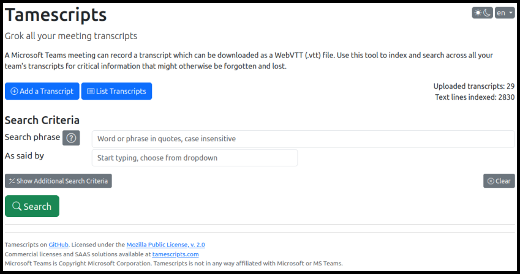

# Tamescripts

*Grok all your meeting transcripts*

When you record a Microsoft Teams meeting a transcript can also be created.
You can download the transcript as a WebVTT .VTT file, but it is difficult to
work with directly, especially when you have tens or hundreds of them.
Use this tool to parse and index your transcript files,
and then search across all your transcripts for critical information
that might otherwise be forgotten and lost.

**This tool is considered complete and will be updated for security issues only**

## Key Features

- Compatible with Microsoft Teams' variant of .VTT files
- Handles a project worth of transcripts
- Search for keywords or phrases with advanced search features
- Simple drill-down into the transcript from search results

## Quick start

- If you don't already have Node.js installed:
  - Download Node.js from [nodejs.org](https://nodejs.org) and install
- Clone or unzip tamescripts somewhere on your machine
- Open a terminal (command prompt) in the new tamescripts directory
- Type `npm install` to download the necessary dependencies
- Type `npm start` to start tamescripts
- browse to <http://localhost:3000>

You can edit `/config/default.json` to change the port number and several other parameters.

The first time you run it will create a SQLite database for you in the tamescripts directory.
This can be backed up and copied/moved as needed.

## Demo

You can try a it online [TBD here TBD](tbd).

The demo contains two short transcripts (TBD). Try some searches such as

- example 1
- example 2
- example 3

You will not be able to load additional transcript in the demo as it's a shared public demo.

## Origin story

Tamescripts was written based on my needs in an 24-month Agile project
with extensive client and SME interviews. In the early days I could keep
it all in my head. Later the transcripts proved invaluable. But as the months
rolled on, relying on recalling specific meetings where a given point was
discussed was no longer practical.
It became a lengthy chore to find the right meeting, and in many cases it was
so time consuming to find discussions than it became tempting or even
necessary to ask the client the same questions again.
This is a dangerous cycle for any project.

Captured decisions are key. But sometimes different technical solutions can
only be properly evaluated later with a richer understanding of context and
underlying need. Often you must go back to the source to understand why a
decision was made in the first place or to capture context that wasn't seen as
relevant in the first pass.

But my needs might not match yours. Your feedback is essential to
understanding what improvements our community needs.

## Technology stack

Express.js, 100% JavaScript implementation with embedded HTML in the ejs files, and just a touch of custom CSS.

Written to be light weight with a minimum npm footprint, it includes:

- express & ejs - web service and page logic
- bootstrap & bootstrap icons - consistent front end structure and CSS
- SQLite - persistance, full text indexing and searching
- config - all configuration in a single json file
- simple-datatables - simple and interactive html tables
- vanillajs-datepicker - clean date picker without framework lock-in

There is no dependence on React, Vue, Angular, or even jQuery.

## Roadmap and

The tool functions well for it's intended purpose, and although there are
many potential enhancements, the effort doesn't match the demand at this time.

## Known Issues

- After about 100 meetings added, the Add process gets slow. After about 200
it gets unbearably slow. This is due to the SQLite full text indexing.
The search is still blazing fast, it's just the addition of meetings that requires patience.
- There are several known UI quirks, but nothing that interferes with functionality.

## Copyright and license

Dual licensed under both [Mozilla Public License 2.0](https://github.com/sheppoor/tamescripts/LICENSE) and commercial licenses.

Microsoft Teams is Copyright Microsoft Corporation.
Tamescripts is not in any way affiliated with Microsoft or MS Teams.
